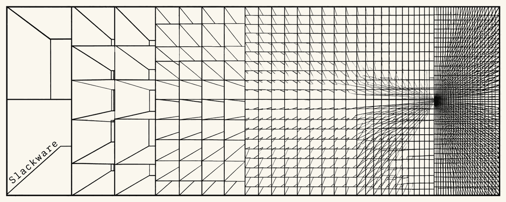

  

Hi, I'm Ricardson (r1w1s1).

Slackware user, open source developer, and Unix enthusiast. I like C, shell
scripting, simple and explicit software, and traditional Unix tools.

## Open Source

- Slackware Core Team member
- SlackBuilds.org maintainer and contributor
- Slackware packaging and small utilities
- Unix, shell, vi/nvi, X11, and minimalist software
- Upstream contributions and patches, including work accepted by [suckless.org](https://tools.suckless.org/slstatus/patches/fmt-human-no-space/)

## Professional

I work with Linux infrastructure, DevOps/SRE, Kubernetes, and production systems.

## Slackware

- [Slackware page](https://slackware.com/~r1w1s1/)
- [SlackBuilds.org maintainer page](https://www.slackbuilds.org/advsearch.php?q=r1w1s1%40fastmail.com&stype=maint)
- [Slackware tagfiles](https://git.sr.ht/~r1w1s1/slackware-tagfiles)

## Notes

I keep a collection of plain-text technical notes on Slackware, Unix,
X11, editors, shell tools, and small systems.

[Browse code-notes →](https://github.com/r1w1s1/code-notes)

## Minimalist Desktop

My daily desktop is a small, keyboard-driven X11 environment built around
CWM, traditional Unix tools, and simple shell scripts.

[Explore my CWM setup →](https://github.com/r1w1s1/cwm-config)

## Featured Repositories

- [code-notes](https://github.com/r1w1s1/code-notes) - Plain-text notes on Slackware, Unix, and small systems.
- [cwm-config](https://github.com/r1w1s1/cwm-config) - Minimal keyboard-driven CWM/X11 desktop.
- [sonicde-SlackBuild](https://github.com/r1w1s1/sonicde-SlackBuild) - SlackBuild for SonicDE.
- [xlibre-SlackBuild](https://github.com/r1w1s1/xlibre-SlackBuild) - SlackBuild for XLibre.
- [slackbuilds](https://github.com/r1w1s1/slackbuilds) - SlackBuilds.org packaging work.

## Codeberg

I also contribute on Codeberg, where I've been working closely with the
[eh editor](https://codeberg.org/SirWumpus/eh), a small vi-family editor
that I use in my daily DevOps workflow.

[Codeberg activity →](https://codeberg.org/r1w1s1?tab=activity)
